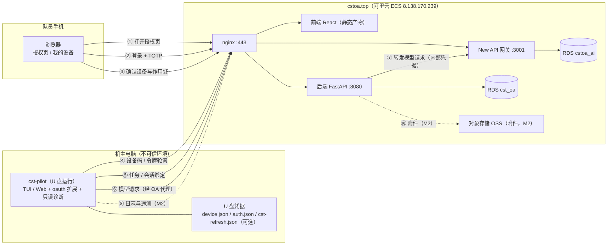

# OA 授权与令牌

状态：草案。更新：2026-09-19。

cst-pilot 的模型接入与身份接入规格，替代在机主电脑上保存长期 API key 的做法。

## 拓扑与数据流

Mermaid 版（GitHub 与支持 Mermaid 的阅读器直接渲染）：



文字拓扑（终端与不支持 Mermaid 的环境）：

```
        ┌─────────────────────────────────────────────────────
        │ 队员手机（浏览器）
        │   ① 手机打开 OA 授权页（输入验证码）
        │   ② 登录 + TOTP 校验
        │   ③ 确认设备与作用域
        └───────────────────────┬─────────────────────────────
                                │ HTTPS
                                ▼
        ┌─────────────────────────────────────────────────────
        │ cstoa.top（阿里云 ECS 8.138.170.239）
        │
        │   nginx :443
        │     ├─ /          → 前端 React（授权页 / 我的设备 / 个人中心）
        │     ├─ /api/*     → 后端 FastAPI :8080（设备流 / 会话 / 任务 / 审计）
        │     └─ /v1、/ai/* → New API 网关 :3001（模型路由，OpenAI 兼容）
        │
        │   后端 FastAPI ── ⑦ 转发模型请求（内部凭据）──► New API 网关 :3001
        │        │                                       │
        │        ▼ ⑨ 会话 / 审计 / 额度                   ▼ ⑨ 模型与额度数据
        │   RDS MySQL cst_oa                        RDS MySQL cstoa_ai
        │        │
        │        └── ⑩ 附件（M2）─────────────────────► 对象存储 OSS
        │
        └───────────────────────┬─────────────────────────────
                                ▲ HTTPS（与应用服务器同一通道）
                                │ ④ 设备码轮询 / 令牌刷新
                                │ ⑤ 任务列表 / 创建会话（绑任务）
                                │ ⑥ 模型请求（经 OA 代理，OpenAI 兼容，流式）
                                │ ⑧ 日志与遥测（M2）
        ┌───────────────────────┴─────────────────────────────
        │ 机主电脑（不可信环境）
        │   cst-pilot（从 U 盘运行）
        │     ├─ TUI / Web UI
        │     ├─ oauth 扩展（本方案新增）
        │     ├─ 只读诊断工具（磁盘 / 进程 / 事件日志 / 驱动）
        │     └─ U 盘凭据（只此一份）
        │          agent/home/auth.json    pi 管理的凭据（access 2 小时；记住模式含 refresh 7 天）
        │          agent/home/device.json 设备标识（仅标识，不作身份证明）
        └─────────────────────────────────────────────────────
```

数据流编号：

| 编号 | 方向 | 内容 | 接口 / 通道 |
|---|---|---|---|
| ① | 手机 → 前端 | 打开授权页（固定入口 + 6 位数字码），展示设备名与作用域 | HTTPS /oauth/device |
| ② | 手机 → 后端 | 登录与 TOTP 校验 | HTTPS /api/* |
| ③ | 手机 → 后端 | 确认或拒绝授权 | /api/oauth/device/decision |
| ④ | agent → 后端 | 申请设备码、轮询令牌 | /api/oauth/device_authorization、/api/oauth/token |
| ⑤ | agent → 后端 | 任务列表、创建会话（绑任务） | /api/agent/tasks、/api/agent/repair-sessions |
| ⑥ | agent → OA 代理 | 模型请求（OpenAI 兼容，流式） | /api/agent/llm/v1/* |
| ⑦ | OA 代理 → 网关 | 内部凭据转发与用量记录 | 内网 127.0.0.1:3001 |
| ⑧ | agent → 后端 | 日志与遥测上报（M2） | /api/agent/telemetry/... |
| ⑨ | 后端 / 网关 → RDS | 会话、审计、额度数据 | MySQL（cst_oa、cstoa_ai） |
| ⑩ | 后端 → OSS | 附件上传（M2） | 对象存储 API |

失败与失效路径：

| 情况 | 处理 |
|---|---|
| 队员拒绝授权 | agent 提示重新开始授权 |
| access_token 过期 | pi 在临期时自动刷新；无 refresh 时提示重新授权 |
| 设备被吊销、队员改密 | 立即失效，重新授权 |
| 网络不可用 | 提示检查网络，无离线模式 |

## 结论

1. 模型接入改为 OA 签发的短期凭据，长期 API key 不再写入机主电脑。
2. 主通道是 OAuth 2.0 设备授权流（RFC 8628），队员用手机扫码确认。
3. 授权主体是队员。机主不是 OA 用户，只出现在修机日志与同意书里。
4. 手机确认时机：默认每场修机需要一次新的设备授权；「记住 7 天」开启后 7 天内免确认（从首次授权起算，不随刷新延长）。
5. 每场都要重新选择并绑定修机任务，不能沿用上一台电脑的任务。
6. 模型调用经 OA 的 OpenAI 兼容代理，用量计入队员个人额度并打「维修」标记（方案 S）。
7. TOTP 随本方案一并实现，设备授权页强制校验；丢失时由管理员重置。
8. 所有令牌按「可能被窃取」设计：短有效期、最小作用域、随时吊销、刷新轮换。
9. 服务器运维不共用本套凭据，独立立项，最后做。

## 阶段

| 阶段 | 内容 | 状态 |
|---|---|---|
| M1 | 设备授权流、TOTP、设备管理、会话与任务绑定、LLM 代理端点、pi 扩展 | 本 spec 主体 |
| M2 | 修机日志、遥测上报、附件 | 概要 |
| M3 | 任务生命周期动作、委员只读 | 概要 |
| M4 | 委员写操作，只对高风险动作确认 | 概要 |
| M5 | 服务器运维，独立设计，只给管理员 | 不在本 spec |

## 术语

| 术语 | 定义 |
|---|---|
| 队员 | OA 成员，修机执行人，授权主体 |
| 机主 | 被修电脑的使用者，非 OA 用户 |
| 设备 | 队员的 U 盘，一人一个，设备与队员一一对应 |
| agent | cst-pilot 发行版（pi 二次开发） |
| OA | cstoa 系统，身份、权限、审计的唯一来源 |
| 网关 | New API 大模型网关 |
| 会话 | 一次修机，从 agent 登录到日志提交 |
| 任务 | OA 任务中心的一条修机工单 |

## 身份与信任模型

| 假设 | 对应设计 |
|---|---|
| agent 运行在机主电脑上 | 该环境不可信；令牌按可能被复制处理 |
| U 盘是队员随身设备 | 凭据只保留一份，位置是 U 盘上 pi 的 auth.json |
| 机主电脑可能带恶意软件 | 不扩大 OA 权限；凭据文件排除在默认文件读取与检索范围之外 |
| 队员手机用于确认 | 登录、TOTP 与设备授权都在手机完成 |

U 盘存储能防什么、不能防什么：

| 项 | 说明 |
|---|---|
| 不能防 | 恶意宿主可以复制 U 盘文件与进程内存中的令牌，甚至修改 U 盘内的扩展 |
| 不能防 | 已签发并被复制的令牌在到期或被服务端吊销前仍然可用 |
| 不能防 | Windows 的 FAT/exFAT U 盘没有 `0600` 这类权限隔离 |
| 能防 | 短有效期、最小作用域、额度限制与服务端吊销把损失限制在时间与范围内 |
| 能防 | 手机 TOTP 保护授权过程；`device.json` 只作标识，不能证明请求来自原 U 盘 |

设计原则：降低被窃令牌的价值。

1. 令牌短有效期，过期即失效。
2. 作用域不超过队员本人权限；凭据文件不进入模型可读范围。
3. 服务端随时可吊销，改密连带吊销；吊销与改密在请求校验时立即生效。
4. 刷新令牌轮换，重放即吊销整台设备；「记住 7 天」从首次授权起算，不随刷新延长。

## 授权流程

### 时序（默认：每场需手机确认）

| 步骤 | 执行方 | 动作 |
|---|---|---|
| 1 | agent | 首次运行生成设备标识，存 U 盘 |
| 2 | agent | 请求设备码，终端显示验证网址与 6 位数字码 |
| 3 | 队员 | 在手机打开固定授权入口，输入数字码 |
| 4 | OA | 要求重新登录并校验 TOTP |
| 5 | OA | 显示设备名、作用域、有效期 |
| 6 | 队员 | 确认或拒绝 |
| 7 | agent | 轮询令牌端点，换取 access token |
| 8 | agent | 列出本人任务，队员选择，创建修机会话 |
| 9 | agent | 正常对话与诊断（模型经 OA 代理） |
| 10 | OA | 到期或吊销后失效 |

说明：

1. 引导队员在手机上打开固定授权入口；不要引导在机主电脑的浏览器登录 OA。
2. pi 原生界面只显示网址与数字码，不会自动打开浏览器。
3. 任务在授权完成后选择；授权页不显示具体任务，只看设备与作用域。
4. 每场都要重新选择任务与创建会话；「记住 7 天」只免除手机确认，不免除任务选择。
5. 默认模式（不记住）下，创建新会话要求最近 5 分钟内完成过设备授权；超时由 agent 引导重新授权。
6. 每场确认加选择任务的操作较多，是安全性的取舍，不作为 pi 的限制。

### 记住 7 天（可选）

1. 队员在授权页勾选「记住这台 U 盘 7 天」，默认关闭。
2. OA 返回 refresh token，由 pi 写入 `auth.json`（U 盘）。
3. 每次刷新换新令牌，旧令牌立即作废。
4. 7 天从首次授权起算，刷新不重新计时；到期、吊销、改密任一发生即失效。
5. 开启后刷新令牌会暴露给期间插过的每台维修电脑，授权页要提示这一点。

### TOTP

1. M1 实现 TOTP 绑定与校验，设备授权页强制。
2. 不设静态恢复码，丢失时由管理员重置（决策 D1）。
3. 个人中心的 2FA 管理功能后续迭代。

## 令牌体系

| 令牌 | 形式 | 存放 | 有效期 | 失效条件 |
|---|---|---|---|---|
| device_code | 服务端一次性 | 服务端 | 5 分钟 | 使用、过期、拒绝 |
| user_code | 6 位数字 | 服务端 | 5 分钟 | 使用、过期、连续失败 5 次 |
| access_token | 无状态 HMAC | pi 的 auth.json（U 盘） | 2 小时 | 到期、吊销设备、改密 |
| refresh_token | 服务端哈希存储 | pi 的 auth.json（U 盘） | 7 天，自首次授权起算 | 到期、吊销、轮换重放 |

access_token 载荷：

| 字段 | 含义 |
|---|---|
| mid | 队员 id |
| typ | 固定 agent，与会话令牌、access 凭据隔离 |
| scope | 授权的作用域列表 |
| device_id | 设备标识 |
| pv | 密码版本，改密即失效 |
| exp / jti | 过期时间与唯一编号 |

约束：

1. 凭据只保留一份：U 盘上 pi 的 `agent/home/auth.json`，由 pi 读写。
2. 不另建 cst-oa.json、cst-refresh.json 一类的缓存副本。
3. access_token 校验时查设备状态与密码版本，吊销、改密即时生效。
4. 令牌签名复用 OA 现有密钥，不新增密钥材料。
5. pi 的凭据类型要求 refresh 为字符串；OA 不下发刷新令牌时以空串适配，并在进入刷新窗口时提示重新授权。

## 作用域

| scope | 能力 | 权限来源 |
|---|---|---|
| llm:chat | 申请网关令牌、调用模型 | 队员本人额度 |
| task:read | 读本人任务 | 队员本人 |
| task:write | 接取、到达、完成 | 队员本人，动作需确认 |
| repair:write | 提交修机日志 | 队员本人 |
| telemetry:write | 上报遥测 | 队员本人 |
| admin:read | 委员读后台（M3） | 本人权限子集 |
| admin:write | 委员写后台（M4） | 本人权限子集，只对高风险动作确认 |

规则：

1. agent 作用域不超过队员本人权限节点。
2. 委员身份不放大权限。
3. 申请的作用域超出队员权限时整单拒绝，不静默裁剪。
4. 作用域在授权页完整展示，队员可见。

## 任务绑定

1. 开修前在 agent 内选择任务，任务列表来自 task:read。M1 即实现。
2. 一个会话绑定一个任务，日志、用量、审计都挂任务编号。
3. 授权令牌不带会话编号。创建会话时由服务端生成 session_id 并绑定设备与任务；后续请求携带 session_id，服务端校验归属，防止多个 agent 会话串用任务。
4. 默认模式下创建新会话要求最近 5 分钟内完成过设备授权。
5. 提交日志前队员确认。
6. 无单上门时，队员用小程序现场报修生成任务，再在 agent 内选择。

## 模型调用

1. OA 提供 OpenAI 兼容代理端点，pi 的 provider 指向该端点，凭据为 OA 访问令牌（方案 S）。
2. 代理校验作用域与额度，转发到 New API，记录审计与用量（打「维修」标记）。
3. 流式响应按 OpenAI 兼容格式透传。
4. 超出队员额度时拒绝。
5. pi 用原生 OAuth 机制自动刷新凭据，不下发网关令牌。

## 日志与遥测（M2）

| 项 | 规则 |
|---|---|
| 鉴权 | 统一用 access_token 的 telemetry:write 作用域 |
| 协议 | 沿用 doc/log 的 schema 与 sender 草案 |
| 上传时机 | 会话结束，失败落盘重试 |
| 脱敏 | 不含用户名、路径、序列号 |
| 保留期 | 180 天 |
| 机主同意 | 签署协议，同意数据用于改进服务 |
| 现场告知 | 展示会上传的字段清单 |
| 附件 | 对象存储，单文件不超过 10 MB |

doc/log 中悬置的 R4「上传鉴权」由本 spec 解决。

## OA 接口契约

M1：

| 方法 | 路径 | 鉴权 | 说明 |
|---|---|---|---|
| POST | /api/oauth/device_authorization | 无，按 IP 限流 | 申请 device_code 与 user_code |
| GET | /oauth/device | OA 会话 | 授权页 |
| POST | /api/oauth/device/decision | 新登录与 TOTP | 确认或拒绝 |
| POST | /api/oauth/token | device_code | 换取 access_token |
| POST | /api/oauth/token | refresh_token | 刷新，轮换 |
| POST | /api/oauth/revoke | OA 会话或设备 | 吊销 |
| GET | /api/agent/devices | OA 会话 | 我的设备列表 |
| DELETE | /api/agent/devices/{id} | OA 会话 | 移除设备 |
| GET | /api/agent/tasks | access_token | 本人任务列表 |
| POST | /api/agent/repair-sessions | access_token | 创建会话，绑定任务 |
| ANY | /api/agent/llm/v1/* | access_token | OpenAI 兼容代理，转发 New API（流式） |

M2 预留：

| 方法 | 路径 | 鉴权 | 说明 |
|---|---|---|---|
| PATCH | /api/agent/repair-sessions/{id} | access_token | 更新日志草稿 |
| POST | /api/agent/repair-sessions/{id}/submit | access_token 与队员确认 | 提交日志 |
| POST | /api/agent/telemetry/sessions | access_token | 遥测批量上报 |

设备授权请求与响应：

1. 请求：设备名、平台、agent 版本、作用域。
2. 响应：device_code、user_code、verification_uri、verification_uri_complete、expires_in=300、interval=5。
3. user_code 为 6 位数字。
4. 轮询错误沿用 RFC 8628：authorization_pending、slow_down、expired_token、access_denied。

## pi 侧集成

| 项 | 方案 |
|---|---|
| 形态 | 扩展，pi.registerProvider 注册自定义 OAuth provider，不改 pi 内核 |
| 登录界面 | pi 原生设备码界面（网址 + 6 位数字码，不自动打开浏览器） |
| 凭据存储 | pi 的 `agent/home/auth.json`，只保留这一份 |
| 取用令牌 | 扩展用 `ctx.modelRegistry.getProviderAuth("cstoa")` 读取当前访问令牌 |
| 刷新行为 | pi 在取凭据、剩余有效期不足 5 分钟时触发 `refreshToken`；扩展不维护独立刷新流程 |
| 设备码轮询 | 扩展自行实现（pi 内部轮询工具未从公共 `/oauth` 入口导出） |
| 命令 | /login 走 pi 原生流程；业务命令如 /cst-task 由扩展注册 |
| 设备标识 | `agent/home/device.json`（仅标识，不作身份证明） |
| 二维码 | 暂不做；已向上游 issue #9774 提案，等待维护者答复 |

实现细节见 [pi 扩展技术方案](pi-extension.md)。

## 安全与审计

| 项 | 设计 |
|---|---|
| 令牌类型隔离 | 会话令牌、access 凭据、agent 令牌互不通用 |
| 签名密钥 | 复用 OA 现有密钥；改密连带吊销由密码版本实现 |
| 密码连坐 | access_token 绑密码版本，改密即失效 |
| 刷新轮换 | 旧 refresh 重放即吊销整台设备 |
| 限流 | 授权端点按 IP；令牌端点按 interval；user_code 连续失败 5 次作废 |
| 审计字段 | 队员、设备、会话、任务、作用域、接口、结果、IP、时间 |
| 审计保留 | 180 天 |
| 吊销入口 | 个人中心「我的设备」、管理员批量、改密连带，校验时即时生效 |

## M1 验收

1. 新 U 盘首跑：终端显示验证网址与 6 位数字码，手机完成登录与 TOTP 后模型可用。
2. 未授权状态下，agent 无法调用模型与 OA 接口。
3. 关闭「记住」时 U 盘内不存在长期凭据；2 小时令牌到期后要求重新授权。
4. 同一 U 盘换到另一台电脑、盘符变化：登录态按有效期延续，但必须重新选择任务并新建会话。
5. 任务列表正确，创建会话后用量与审计挂在所选任务上；多开 agent 会话不能串用任务。
6. 改密后既有令牌立即失效；个人中心吊销设备后，该设备所有令牌立即失效。
7. 记住模式 7 天到期后要求重新授权；到期时间从首次授权起算。
8. 并发请求触发的刷新只发生一次；断网或写盘失败时给出明确提示。
9. 用量计入队员个人额度，可在概览页看到。

## 里程碑

| 阶段 | 交付 |
|---|---|
| M1 | OA 设备授权流、TOTP、设备管理页、会话与任务绑定、LLM 代理端点；pi 扩展；模型调用 |
| M2 | 修机日志草稿与提交；遥测合并上报 |
| M3 | 任务动作（接取、到达、完成）；委员只读 |
| M4 | 委员写操作，只对高风险动作确认 |
| M5 | 服务器运维，独立设计 |

## 决策记录（2026-09-19）

| 编号 | 议题 | 决定 |
|---|---|---|
| D1 | TOTP 恢复方式 | 管理员重置，不设静态恢复码 |
| D2 | 记住 7 天默认值 | 默认关闭 |
| D3 | refresh 存储 | 明文存 U 盘 |
| D4 | 无单上门 | 现场补建任务，走小程序报修 |
| D5 | 维修用量统计 | 挂个人额度并打「维修」标记 |
| D6 | 委员写操作确认 | 只对高风险动作确认 |
| D7 | 用户码格式 | 6 位数字 |
| D8 | 审计保留期 | 180 天 |
| D9 | 令牌签名密钥 | 复用 OA 现有密钥 |
| D10 | 任务绑定阶段 | M1 即绑定 |
| D11 | 模型接入路径 | 方案 S：OA 提供 OpenAI 兼容代理，pi provider 指向 OA |
| D12 | 登录界面 | pi 原生设备码界面；二维码走上游 issue 讨论 |
| D13 | 手机确认时机 | 默认每场（服务端校验最近 5 分钟授权）；记住模式 7 天内免确认 |
| D14 | 凭据存储 | 只保留 pi 的 auth.json 一份；不建额外缓存 |

## 不做

1. 服务器运维自动化。M5 独立立项，只给管理员。
2. agent 自动执行修复命令。维持命令清单人工执行。
3. 离线 AI。无网络即不可用。
4. 反钓鱼专项交互设计。内部工具，只保留基础限流与短有效期。
5. 第三方客户端注册。接口保持 OAuth 2.0 兼容，暂只服务 cst-pilot。

## 与现有文档的关系

1. doc/log 的 schema 与发送端方案保留，R4 上传鉴权由本 spec 替代。
2. doc/PRD.md 的运行通道不变，身份与凭据部分以本 spec 为准。
3. OA 侧的任务拆分见 cstoa-api-fastapi 仓库 [docs/oa-tasks.md](https://github.com/SCAU-Computer-Serving-Team/cstoa-api-fastapi/blob/main/docs/oa-tasks.md)。
4. pi 扩展的实现方案见 [pi 扩展技术方案](pi-extension.md)。
