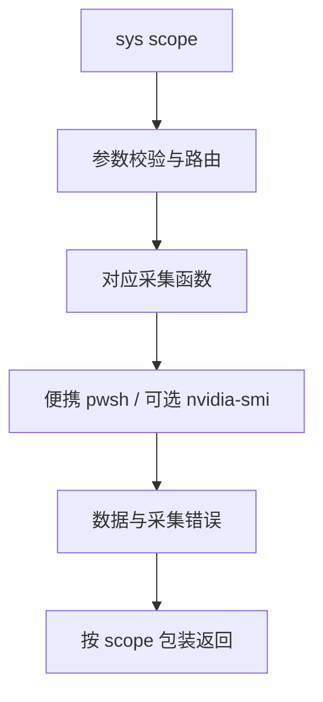

# sys 设计

状态：已实现。需求：[PRD R1–R4](../../PRD.md)；接口：[sys](../../tool/sys.md)；验证：[测试指南](../../test/README.md)。R5 自启配置由独立的 [startup](../../tool/startup.md) 实现。

## 目标与边界

sys 提供维修现场的实时负载和传感器数据，回答“谁在消耗资源、哪里可能受限”。遵循只读、零宿主安装、结构化返回的约束。

| 工具 | 职责 |
|---|---|
| sys | 当前负载、进程、IO、GPU、可读传感器 |
| disk | 容量、空间分布和 SMART |
| startup | 开机启动配置 |
| driver | 设备识别和驱动状态 |
| eventlog | 历史故障线索 |

## 接口组织

选择一个工具、多个 scope，默认 overview。与每个领域注册独立工具相比，它减少重复描述并复用采集设施；与全量快照相比，它避免每次都执行双采样、GPU 和传感器查询。

startup 单独注册：静态启动配置与实时负载的问题不同，也不共享采样过程。top 默认 10、最大 50，仅作用于 proc/gpu/io。

## 数据源与决策

| scope | 方案 | 选择理由 |
|---|---|---|
| proc | Get-Process 双采样，按实际间隔和逻辑核数计算 CPU；工作集与路径取快照 | 避开历史实测较慢的 PerfProc 查询；同一进程内采样减少启动成本 |
| overview | CIM 机型、内存、页面文件、开机时间；格式化 CPU 类预读后再取值 | 类名不依赖系统语言；集中提供整机判断所需背景 |
| io | Win32_Process 累计 IO 差分 + PerfDisk 格式化类 | 共用实际采样窗口，分别呈现进程活动与物理盘负载 |
| gpu | GPU Engine、Process Memory、VideoController；并行查询 nvidia-smi | 保留进程利用率、显存和适配器信息；NVIDIA 为可选数据源 |
| sensor | LHM 用户态 + 热区/频率计数器 | 不为诊断安装内核驱动，使用可获得的温度和限频线索 |

### GPU 聚合

按进程取最繁忙引擎的利用率，保留适配器和引擎样本，不将并行引擎相加。NVIDIA 返回每卡状态数组，带 uuid/pciBusId；程序不存在或失败时尝试 LHM 补充。

GPU 引擎查询失败重试一次；各路计数器分别记录错误，其他成功数据继续返回。GPU 和传感器的性能路径通过 PDH 本地化，不依赖固定英文路径或 Perflib 注册表名称表。

### 传感器范围

LHM 随发行包提供，只启用所需硬件类别，避免无关依赖初始化。过滤非有限值与明显无效的热区温度，限制传感器数量。热区、频率读取失败直接说明原因，不自动重复尝试所有传感器。

不安装内核驱动。核心温度不可读时说明限制；频率下降只作线索，不能代替温度测量或直接证明过热。

## 错误与输出

公共 PowerShell 包装保留非终止错误为 collectionErrors/degraded；各专用数据源另返回具体错误。失败、无硬件、暂时没有活动是不同状态，输出必须允许调用方区分。

排行受 top 限制，传感器最多 200 项。进程路径、驱动信息、计数器可能缺失，保留 null 和错误，不补造数值。

## 验证

按[测试指南](../../test/README.md)执行 sys 公共组及对应环境差异项。验证记录放在 `doc/test/testlog/`，单台机器的结果不作为跨机器性能保证。
