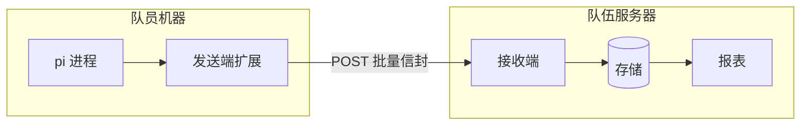
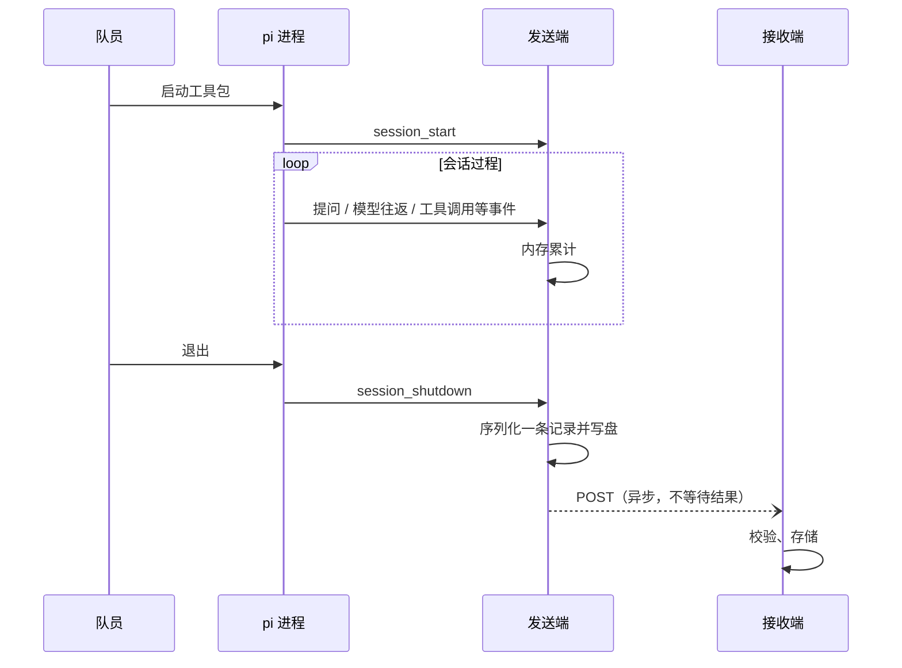

# 系统架构

状态：讨论中，契约版本 0.1。更新：2026-09-20。

采什么、不采什么由 [信息收集契约](../contract.md) 决定，会话记录字段见其下的 [schema.md](schema.md)。本文只管系统怎么切块，不重复契约内容。

## 组成

系统由两端组成，中间只隔一条 HTTP POST。

- 发送端：队员机器上 pi 进程内的扩展，采集会话数据并上报。
- 接收端：队伍服务器上的服务，接收记录、存储、供查询与报表。

没有别的通道：无长连接、无拉取、无命令下发。

数据形态：线上传批量信封（一次 POST 带一批记录）。发送端缓存用 JSONL，一行一条，按 `recordId` 去重；接收端的原始层是 `sessions.payload` 列，不再另落一份文件。

## 会话生命周期

数据以会话为单位流动。一场会话产生一条记录。

pi 的会话事件机制覆盖会话切分的所有情况：退出、切换会话、恢复、分叉、重载，每种情况都触发 `session_shutdown` + `session_start` 对。发送端靠这一对事件界定一场会话的边界，不加额外 hook。

## 关键决策

| 决策 | 结论 | 理由 |
|---|---|---|
| 数据粒度 | 一场会话一条记录 | 失败只丢一条；采集实现简单；报表按会话聚合 |
| 通信通道 | 仅一条 POST | 无实时需求；简单、可重试、可缓存补发 |
| 发送端形态 | pi 扩展，寄住 pi 进程 | 零安装；事件机制现成；随发行分发 |
| 容错假设 | 丢一条记录可接受 | 采集与传输失败不影响队员主业 |

进程非正常退出没有 `session_shutdown`，该场会话全丢。这是会话级粒度的固有代价，接受为已知限制。

## 技术栈

| 层 | 选型 | 说明 |
|---|---|---|
| 发送端 | pi 扩展，TypeScript，零 npm 依赖 | 寄住 pi 进程，jiti 免编译运行；只用 Node 内置模块与全局 `fetch` |
| 传输 | HTTPS POST + JSON | 唯一通道；端点 URL 随发行写入 `telemetry.json` |
| 接收端 | 阿里云服务器自建 Node 常驻服务 | 框架与存储细化见 [receiver/SPEC.md](receiver/SPEC.md)；HTTPS 由服务器侧证书提供；代码在本仓库 `src/telemetry/`，不经工具包发行；身份解析靠 OA 的令牌内省接口，尚未实现 |

合规约束：数据只落在队伍的阿里云服务器，不经任何第三方。schema 的脱敏设计（无对话内容、无路径原文、身份由上传凭据解析）在此基础上成立，随报错原文回显的内容是契约里显式记录的唯一例外。

仓库边界：发送端在 `agent/home/extensions/telemetry/`，随本仓库发行；接收端在 `src/telemetry/`，同仓库但不进发行包，部署到服务器上单独运行。两者以 [信息收集契约](../contract.md) 为唯一共享契约，会话记录字段是其下的 [schema.md](schema.md)；同仓库直接引用，不再另存副本。