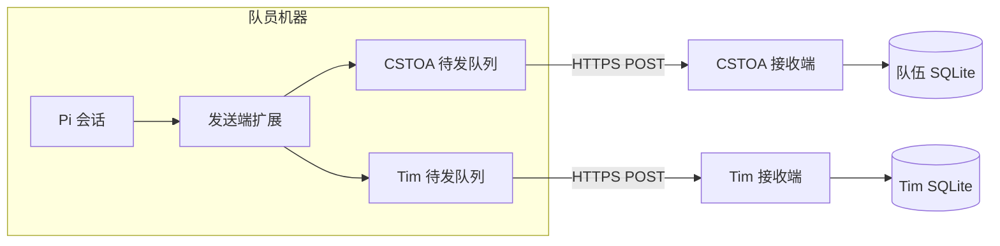

# 系统架构

发送端在 Pi 进程内采集会话统计，并将同一记录上传到 CSTOA 与 Tim 两个独立接收端。契约版本 0.1。字段与隐私边界见[信息收集契约](../contract.md)，运行验证见[验证报告](../test/telemetry-report.md)。

## 组成

| 组成 | 职责 |
|---|---|
| 发送端扩展 | 按会话实例累计、保存草稿、定稿，并维护每个端点的待发队列 |
| CSTOA 接收端 | 校验 OA 令牌，存入队伍服务器 SQLite，提供命令行导出 |
| Tim 接收端 | 使用同款 Go 程序，校验 OA 令牌，独立存入 `timserver_1` SQLite |

```mermaid
flowchart LR
    subgraph member[队员机器]
        pi[Pi 会话] --> sender[发送端扩展]
        sender --> oaQueue[CSTOA 待发队列]
        sender --> timQueue[Tim 待发队列]
    end
    oaQueue -- HTTPS POST --> oa[CSTOA 接收端]
    timQueue -- HTTPS POST --> tim[Tim 接收端]
    oa --> oaDB[(队伍 SQLite)]
    tim --> timDB[(Tim SQLite)]
```

线上传输只有批量 HTTPS POST，无长连接、拉取或命令下发。两端收到相同的 `recordId` 和会话统计，各自补充接收时间与身份；各自确认、去重和保留数据。

本地记录为 JSONL，每个端点一个 `pending-<URL的SHA256>.jsonl` 文件。普通草稿按会话保存；接收端原始记录保存在 `sessions.payload`。

## 会话生命周期

| 时机 | 动作 |
|---|---|
| 轮次结束 `turn_end` | 累计统计，重写当前会话草稿 |
| 会话实例结束 | 定稿写入全部端点队列，删草稿，分别触发异步上传 |
| 进程启动 | 恢复残留草稿，标记 `crash`；将单端点待发文件迁移到当前各端点队列 |
| 某端点确认 | 只从该端点队列删除对应记录，其他端点状态保持不变 |

TUI 定稿由 `session_shutdown` 触发；Web 在删除会话、关闭运行层时定稿。切换 Web 页面不会结束会话实例。正常退出等待定稿落盘，不等待网络响应。

TUI 与多个 Web 会话分别累计、各写草稿。本地文件读写经进程级串行队列，各端点发送使用独立的单飞状态。一个端点超时、拒绝或停采不阻塞其他端点。

强杀时，下次启动用最后已完成轮次恢复；没有完成轮次的会话无草稿可恢复。磁盘写入失败、队列淘汰和进程强杀允许有限丢失。详细规则见[发送端](sender/SPEC.md)。

## 技术与部署

| 层 | 实现 |
|---|---|
| 发送端 | TypeScript Pi 扩展，无新增 npm 依赖 |
| 传输 | HTTPS POST + JSON；CSTOA 使用系统证书验证，Tim 使用随扩展发行的专用公开 CA |
| 身份 | 两个接收端分别调用 OA 内省，服务凭据只保存于服务器 |
| CSTOA | systemd、nginx、Go、SQLite |
| Tim | 独立 Docker Compose、Caddy、同款 Go、SQLite；证书自动续签，每日一致性备份 |

数据同时落在队伍服务器与 Tim 的 `timserver_1`，不经过第三方数据接收服务。报错原文是可能包含敏感片段的例外，两端执行相同保留期。

发送端位于 `agent/home/extensions/telemetry/`，随本仓库发行；服务端代码位于独立仓库 `cst-pilot-server`，以本仓库契约为共享依据。两个部署的具体入口、存储和运维边界见[接收端](receiver/SPEC.md)。
