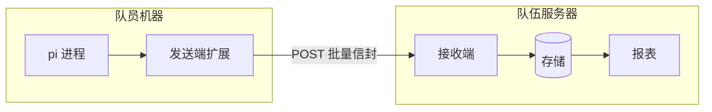
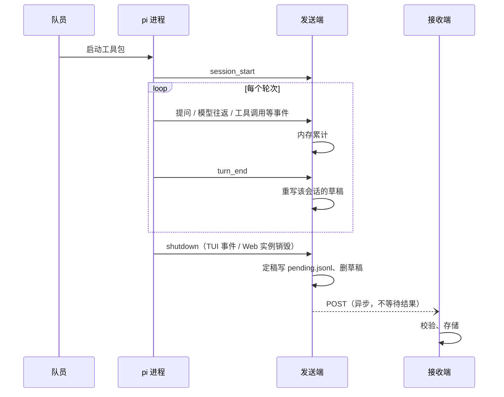

# 系统架构

状态：已定稿，实现与 e2e 验证完成。契约版本 0.1。更新：2026-10-03。

采什么、不采什么由 [信息收集契约](../contract.md) 决定，会话记录字段见其下的 [schema.md](schema.md)。本文只管系统怎么切块，不重复契约内容。

## 组成

系统由两端组成，中间只隔一条 HTTP POST。

- 发送端：队员机器上 pi 进程内的扩展，采集会话数据并上报。
- 接收端：队伍服务器上的服务，接收记录、存储、供查询与报表。

没有别的通道：无长连接、无拉取、无命令下发。

数据形态：线上传批量信封（一次 POST 带一批记录）。发送端缓存用 JSONL，一行一条，按 `recordId` 去重；进行中的会话另有轮次级草稿，见下节；接收端的原始层是 `sessions.payload` 列，无单独文件。

```mermaid
flowchart LR
    subgraph member[队员机器]
        pi[pi 进程]
        sender[发送端扩展]
        pi --> sender
    end
    subgraph server[队伍服务器]
        receiver[接收端]
        store[(存储)]
        report[报表]
        receiver --> store --> report
    end
    sender -- "POST 批量信封" --> receiver
```

## 会话生命周期

数据以会话为单位流动。一场会话产生一条记录。持久化分两层：轮次结束写草稿，会话结束定稿。

| 时机 | 动作 | 两端差异 |
|---|---|---|
| 轮次结束（`turn_end`） | 把该会话的累计状态重写为草稿文件 | 无。采集器内部行为，两端一致 |
| 会话结束（shutdown） | 定稿：补 `endedAt`、`endReason`，追加写 `pending.jsonl`，删草稿，触发发送 | 同一概念，实现不同：TUI 由 pi 的 `session_shutdown` 事件触发；Web 会话不经 pi 会话替换，由 Web 运行层在销毁会话实例时调用定稿 |
| 进程启动 | 扫描草稿目录，残留草稿即上次强杀的现场，补 `endReason = crash` 的记录后删除 | 无 |

```mermaid
sequenceDiagram
    participant U as 队员
    participant P as pi 进程
    participant S as 发送端
    participant R as 接收端

    U->>P: 启动工具包
    P->>S: session_start
    loop 每个轮次
        P->>S: 提问 / 模型往返 / 工具调用等事件
        S->>S: 内存累计
        P->>S: turn_end
        S->>S: 重写该会话的草稿
    end
    P->>S: shutdown（TUI 事件 / Web 实例销毁）
    S->>S: 定稿写 pending.jsonl、删草稿
    S--)R: POST（异步，不等待结果）
    R->>R: 校验、存储
```

TUI 的会话替换（退出、切换、恢复、分叉、重载）每种情况都触发 `session_shutdown` + `session_start` 对。Web 会话挂在 Web 扩展自建的 runtime 下，不走这对事件，定稿钩子挂在 [Web 运行层的实例销毁路径](../web/SPEC/session-runtime.md#共享状态)。两端并存时，一场 TUI 会话与多场 Web 会话可以同时在跑：每场会话实例各自累计、各写各的草稿；`pending.jsonl` 与发送经进程级互斥协调，见 [sender/SPEC.md](sender/SPEC.md)「队列」。

## 关键决策

| 决策 | 结论 | 理由 |
|---|---|---|
| 数据粒度 | 一场会话一条记录 | 失败只丢一条；采集实现简单；报表按会话聚合 |
| 通信通道 | 仅一条 POST | 无实时需求；简单、可重试、可缓存补发 |
| 发送端形态 | pi 扩展，寄住 pi 进程 | 零安装；事件机制现成；随发行分发 |
| 会话边界 | 会话实例销毁即定稿，两端用同一概念 | TUI 走 pi 的 shutdown 事件；Web 会话不经 pi 会话替换，钩子挂 Web 运行层的实例销毁路径 |
| 耐久性 | 轮次级草稿 | 工具包常驻U盘，即用即走，机主电脑崩溃会强杀进程；草稿把丢失窗口从整场会话缩到一轮 |
| 容错假设 | 丢一条记录可接受 | 采集与传输失败不影响队员主业 |

进程被强杀（拔盘、断电、机主电脑蓝屏）时没有定稿机会，残留草稿在下次进程启动时补记，`endReason = crash`，`endedAt` 取最后轮次的结束时刻。尚无完成轮次的会话没有草稿，仍然全丢，接受为已知限制。

## 技术栈

| 层 | 选型 | 说明 |
|---|---|---|
| 发送端 | pi 扩展，TypeScript | 寄住 pi 进程，jiti 免编译运行；零 npm 依赖，只用 Node 内置模块与全局 `fetch` |
| 传输 | HTTPS POST + JSON | 唯一通道；端点 URL 随发行写入 `telemetry.json` |
| 接收端 | 阿里云服务器自建 Node 常驻服务 | 框架与存储细化见 [receiver/SPEC.md](receiver/SPEC.md)；HTTPS 由服务器侧证书提供；代码在独立仓库 `cst-pilot-server`，不经工具包发行；身份解析靠 OA 的令牌内省接口，尚未实现 |

合规约束：数据只落在队伍的阿里云服务器，不经任何第三方。schema 的脱敏设计（无对话内容、无路径原文、身份由上传凭据解析）在此基础上成立，随报错原文回显的内容是契约里显式记录的唯一例外。

仓库边界：发送端在 `agent/home/extensions/telemetry/`，随本仓库发行；接收端在独立仓库 `cst-pilot-server`，部署到服务器上单独运行。两者以 [信息收集契约](../contract.md) 为唯一共享契约，会话记录字段是其下的 [schema.md](schema.md)；契约文档随主仓库演进，接收端实现时对照。