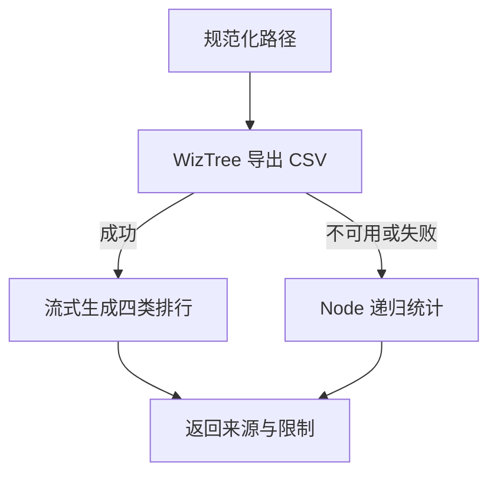

# disk：存储分析

查询卷空间、物理盘信息、SMART 和目录占用。实时磁盘负载使用 [sys io](sys.md#io磁盘与进程读写)。本工具只做统计，不判断文件是否可以安全删除。

实现：[disk.ts](../../agent/home/extensions/diagnostics/disk.ts)。

## 调用

```js
disk({ scope: "space" })
disk({ scope: "info", drive: "H" })
disk({ scope: "health", drive: "C" })
disk({ scope: "usage", path: "C:\\Users", top: 10 })
disk({ scope: "all", drive: "C" })
```

| 参数 | 必填 | 说明 |
|---|---|---|
| `scope` | 是 | `space`、`info`、`health`、`usage` 或 `all` |
| `drive` | 否 | `C` 或 `C:` 等盘符；用于 space/info/health/all，省略查询全部 |
| `path` | usage 必填 | 目录或卷根路径，进入扫描前统一规范化 |
| `top` | 否 | usage 排行项数，默认 20，最大 100 |

## space：卷空间

返回 `space[]`，每项包含 `drive`、`totalGB`、`freeGB`、`usedPct`。使用 Node `statfsSync`，不启动 PowerShell。`freeGB: 0` 表示剩余空间为零，不是缺失值。

容量字段使用二进制换算（字节 ÷ 2³⁰），名称沿用 `GB`。

## info：物理盘与逻辑卷

| 字段 | 主要内容 |
|---|---|
| `physicalDisks[]` | 型号、序列号、MediaType、BusType、HealthStatus、OperationalStatus、sizeGB |
| `volumes[]` | drive、label、fs、driveType、totalGB、freeGB |
| `infoNotice` | 盘符与物理盘关联失败时说明过滤范围 |

物理盘来自 `Get-PhysicalDisk`，卷来自 `Win32_LogicalDisk`。单条和多条成功结果都返回数组；数据源失败可在对应字段中返回错误对象。

指定 `drive` 时，卷直接按盘符过滤，物理盘通过分区关联筛选。**关联失败时物理盘返回未过滤清单，并明确说明；卷仍按盘符过滤。** `driveType` 使用 Fixed、Removable、Network、Optical 等可读值。

## health：SMART 可靠性数据

`smart` 返回可靠性记录数组或 `null`，包括设备支持的磨损度、温度、通电小时、读写错误等。数据来自 `Get-StorageReliabilityCounter`；可用字段取决于设备、驱动、桥接方式和权限。

- 指定盘符时只查询其关联物理盘；关联失败则不查询 SMART，并说明原因。
- 部分盘查询失败时保留成功记录，错误放在 `smartErrors`。
- 只有实际权限拒绝才提示以管理员身份重启。其他失败保留原始原因，不能统一解释为缺少管理员权限。
- `smart: null` 不代表硬盘健康，也不代表硬盘损坏。

`all` 合并 space、info、health；某项失败不应妨碍阅读其他成功结果。

## usage：占用分析

成功的 WizTree 路径返回 `usage` 对象：

| 字段 | 说明 |
|---|---|
| `root` / `totalGB` | 扫描根路径及其大小 |
| `method` | `wiztree-mft`、`wiztree-walk` 或降级后的 `node-walk` |
| `topDirs` | 子目录排行；包含不同深度目录，父子项可能重叠，不能相加 |
| `topFiles` | 单个大文件排行 |
| `extAgg` | 按扩展名聚合的数量与大小 |
| `staleFiles` | 至少 50 MB 且一年未修改的文件，大者优先；仅是排查线索 |
| `notice` / `degradedFrom` | 数据来源、统计限制及降级原因 |

排行使用 `path`、`sizeGB`，目录和文件排行另含 `pct`。小目录自动增加小数位，减少显示为 0 的情况。

### 扫描与降级



WizTree 随包提供，以 `/admin=0` 调用。NTFS 按 `wiztree-mft` 标注，其他文件系统按 `wiztree-walk` 标注；探测失败时在 notice 中说明，不能仅凭工具名认定使用了 MFT。文件系统探测使用 fsutil，并以 CIM 兜底；缓存复用前校验卷身份。

`wiztree\WizTree3.ini` 保存随机器变化的显示状态，不参与 CLI 结果。`pi.cmd` 启动时尝试将它重命名为 `WizTree3.ini.bad`，让 WizTree 重建显示状态；文件独占锁定需另行处理，见 [运行注意事项](../Notice.md#每次启动清除-wiztree3ini)。

CSV 按路径和字节数解析，不依赖本地化表头；日期使用独立匹配。排行采用流式 Top-N，避免收集全部文件再排序。可识别卷的目录和大文件数据同时写入 [共享缓存](wz-index.md)，供后续 ls 使用；只有已扫描路径能从中受益。

**Node 降级路径仅返回目录排行**，不保证有 topFiles、extAgg、staleFiles。它使用 50 万次 stat 预算，附带 `stats`、`truncated` 和可能的 `denied`；被拒绝访问或预算外的内容不计入，总量可能是下界。

## 限制

- 大目录扫描可能很慢；慢速移动介质还会放大运行时启动和 CSV 读写耗时。
- 扫描是某一时刻的快照，期间文件变化可能造成偏差。扫描期间检测到换盘会报错，避免发布旧卷结果。
- 临时目录创建失败会进入降级；这不等于整个便携运行环境已支持只读介质。
- 数据源不可用时遵循 [公共错误约定](README.md#返回结构)，不能从空值推断健康状态。
