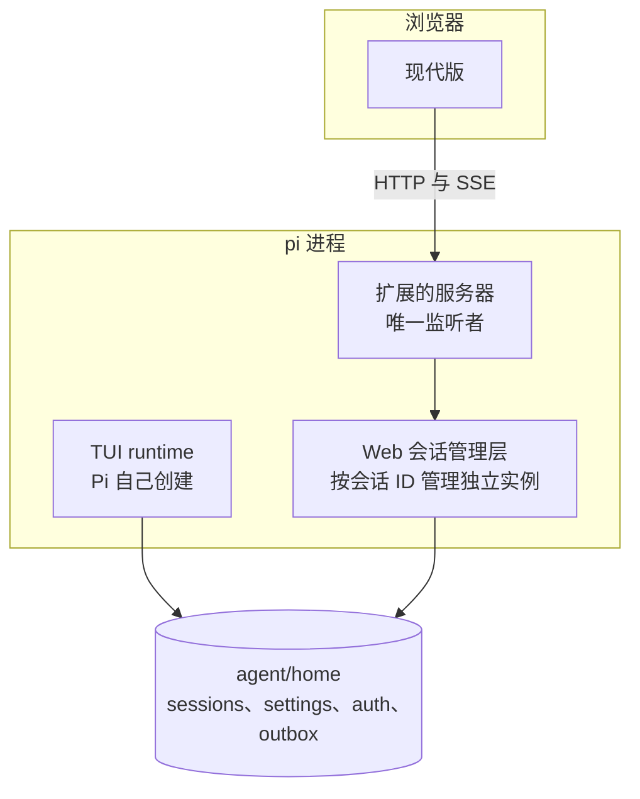

# Web 技术决策

状态：进程内承载、页面形态与技术栈已定；多会话装配及官方 Windows 二进制接管已验证。更新：2026-09-26。

本文记录 Web 端的关键选择与理由。需求见 [PRD](../../PRD.md)，安排见 [Todo](../../Todo.md) 第 3 条，实测数据见[实测记录](measurements.md)，Pi 能力见 [Pi 能力清单](pi-capability.md)。

## 承载与启动

`/web` 在 Pi 进程内启动 Web，并使 TUI 进入待机。TUI 释放已保存的原会话后，Web 扩展用 SDK 接管；后续由 Web 管理多个会话。不新增进程、不改 Pi 内核，见 [运行承载](pi-capability.md#运行承载)。

| 事项 | 决定 |
|---|---|
| 启动 | 通过 `pi.cmd` 启动 pi，再执行 `/web` 自动打开本机浏览器 |
| 版本选择 | **MVP 只有现代版**，`/web` 直接打开。兼容版排在功能完善之后 |
| 端口 | 固定偏高端口；占用或启动失败时明确报错 |
| 监听范围 | 仅本机回环地址，不提供局域网或远程访问 |
| 运行依赖 | 使用发行包自带运行时；现场无需安装 Node、npm 或执行构建命令 |
| 页面资源 | 脚本、样式、字体随包提供，不依赖 CDN；模型与联网工具仍按各自配置访问网络 |
| 会话关系 | TUI 保留待机窗口，Web 接管已保存的原会话；同一会话只有一个执行实例 |

待机与接管、输入收件箱及共享状态规则见[会话运行与并行](../SPEC/session-runtime.md#写权与会话串行)。

## 请求入口

扩展的 HTTP 服务器是唯一请求入口，直接处理 API 与静态资源。

| 路径 | 去向 |
|---|---|
| `/api/*` | 扩展同模块直接处理 |
| 其余全部 | 扩展的静态处理器 |

**只判断一次，没有转发层。** 依据见[页面形态](#页面形态)。

## 页面形态

**静态 SPA，运行期只有一个服务器。**

| 形态 | 文件增量 | 运行期服务器 | 运行期动态段 | 首屏有真实内容 |
|---|---|---|---|---|
| **静态 SPA（选定）** | **16 文件** | **1** | 可以，靠服务器兜底 | 否 |
| Next 服务端产物 | 1,289 文件 | 2，含转发 | 可以，框架原生 | 是 |

### 选择依据

1. 本机回环样例中，两种页面形态的 FCP 相同，路由切换差异处于采样波动范围；真实内容可见时间相差 8–55 ms。
2. 样例静态 SPA 产物为 16 个文件，Next 服务端发行集为 1,289 个文件。少文件更符合便携分发目标。
3. 本项目由扩展直接处理接口，没有服务端页面渲染、React 服务端组件（RSC）或 Server Actions 的需求。
4. 路由、构建与静态服务分别维护，便于独立测试和替换。

数字仅适用于[实测记录](measurements.md)中的样例。Chromium 86 兼容性单独验证，不能由编译目标配置推断全部运行时 API 可用。

### 静态 SPA 的代价

| 代价 | 处理 |
|---|---|
| 首屏 HTML 不含会话数据 | 先显示布局与占位，获取数据后填充；性能按实际页面验收 |
| 地址靠服务器回退 | 仅对导航请求返回页面入口，见[路由组织](../SPEC/app-router.md#路由组织) |
| 没有 RSC 与 Server Actions | 本项目用不上 |
| 没有图片优化 | 资源是固定图片与字体，不需要按需优化 |

### 地址形态

会话地址采用 `/s/<sessionId>`。会话 ID 是运行期数据，静态产物无法在构建期枚举它，所以由服务器的兜底规则把未命中的路径交给页面入口，浏览器解析地址。

## 前端技术栈

采用 TypeScript 与 React，提供现代版与兼容版。两版共享业务逻辑与组件接口，样式和构建参数按兼容要求分开。

| 事项 | 决定 |
|---|---|
| 构建工具 | Vite |
| 路由 | react-router 框架模式，`ssr: false` |
| 现代版 | React 19 + Tailwind v4 + HeroUI v3 |
| 兼容版 | React 19 + Tailwind 3.4 + 自实现组件 |
| 共享源码 | 共享组件与逻辑代码，两版 React 版本相同 |
| 两套样式 | 共用业务含义和组件接口，分别处理两版 Tailwind 的差异 |
| 组件库 | HeroUI v3（`@heroui/react` + `@heroui/styles` 3.2.5）为基准，允许其他第三方库 |
| 兼容版组件 | 不用 v3 的产物 CSS；自己实现组件，DOM 结构与类名跟 v3 一致 |
| 页面组织 | 主要页面支持地址、直接打开、刷新与前进后退 |
| 图表与动效 | 后续按设计选择现成库；兼容版允许简化效果 |

两版共用 React 19；样例已验证基础渲染与事件。现代版的 Chromium 111 基线由 Tailwind v4 决定，React 扩展 API 在兼容版中仍需验证。

工程结构、状态归属与打包接入见[前端工程](../SPEC/frontend.md)，两档基线与写法约束见[浏览器基线](../SPEC/frontend.md#浏览器基线)。

## 开发与分发

开发仓库保留源码，发行包携带可直接运行的产物。

| 事项 | 决定 |
|---|---|
| 设计流程 | 先用 Pencil 制作页面原型，再确定前后端契约；动效在设计阶段专门处理 |
| 开发方式 | 使用 AI 辅助实现 |
| 依赖 | 允许第三方库；控制分发文件数量，避免将开发依赖树直接带入发行包 |
| 版本产物 | MVP 仅现代版；兼容版在后续加入并确定入口 |
| 打包接入 | 后续接入现有 `pack` 流程，为 Web 明确运行文件清单 |
| 包形态 | 本仓库内的 pi 接入与 Web 工程，随便携发行包交付；在 pi 进程内自建 runtime，不新增进程 |

前端源码放在扩展目录外，保留现有整目录复制规则。后续增加静态产物与许可证校验，见[打包接入](../SPEC/frontend.md#打包接入)。

## 验证

会话装配、共享资源与发行二进制的验证集中在 [待处理议题](../../issues.md#1-承载与运行)。
