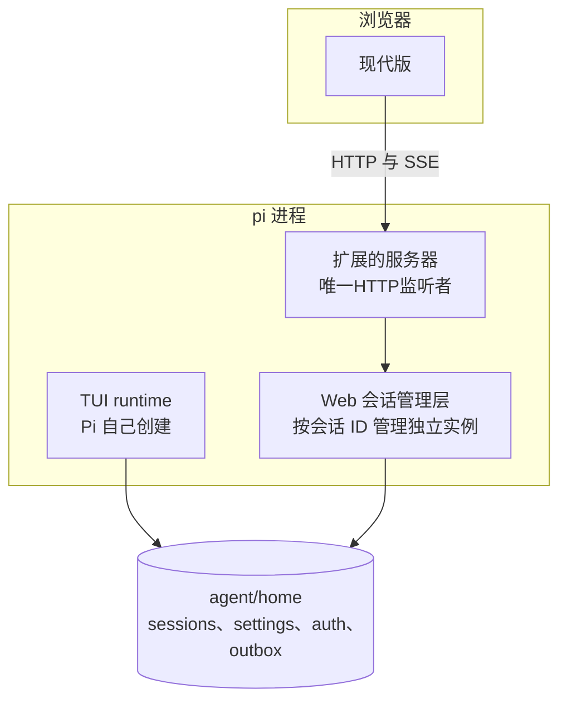

# Web 技术决策

状态：进程内承载、页面形态与技术栈已定；多会话装配及官方 Windows 二进制接管已验证。更新：2026-10-07。

本文记录 Web 端关键选择的理由与实测依据。行为与接口的结论在 SPEC，不在本文重复。需求见 [PRD](../../PRD.md)，数字见[实测记录](measurements.md)，Pi 能力见 [Pi 能力清单](pi-capability.md)。

## 承载与启动

`/web` 在 Pi 进程内启动 Web，并使 TUI 进入待机。TUI 释放已保存的原会话后，Web 扩展用 SDK 接管；后续由 Web 管理多个会话。不新增宿主进程、不修改 Pi 源码或官方可执行文件，见 [运行承载](pi-capability.md#运行承载)。

```mermaid
flowchart TB
    subgraph 浏览器
        N[现代版]
    end
    subgraph 进程[pi 进程]
        S[扩展的服务器<br/>唯一HTTP监听者]
        T[TUI runtime<br/>Pi 自己创建]
        W[Web 会话管理层<br/>按会话 ID 管理独立实例]
        S --> W
    end
    H[(agent/home<br/>sessions、settings、auth、outbox)]
    N -->|HTTP 与 SSE| S
    T --> H
    W --> H
```

| 事项 | 决定 |
|---|---|
| 启动 | 通过 `pi.cmd` 启动 pi，再执行 `/web` 自动打开本机浏览器 |
| 版本选择 | MVP 只有现代版，`/web` 直接打开；兼容版排在功能完善之后 |
| 端口 | 固定偏高端口；占用或启动失败时明确报错 |
| 监听范围 | 仅本机回环地址，不提供局域网或远程访问 |
| 运行依赖 | 使用发行包自带运行时；现场无需安装 Node、npm 或执行构建命令 |
| 页面资源 | 脚本、样式、字体随包提供，不依赖 CDN；模型与联网工具仍按各自配置访问网络 |
| 会话关系 | TUI 保留待机窗口，Web 接管已保存的原会话；同一会话只有一个执行实例 |

待机与接管、输入收件箱及共享状态规则见[会话运行与并行](../SPEC/session-runtime.md#写权与会话串行)。

## 页面形态

**静态 SPA，运行期只有一个服务器。** 形态与工程边界见[前端设计](../../design/web/frontend.md#页面形态)。

| 形态 | 文件增量 | 运行期服务器 | 运行期动态段 | 首屏有真实内容 |
|---|---|---|---|---|
| **静态 SPA（选定）** | **16 文件** | **1** | 可以，靠服务器兜底 | 否 |
| Next 服务端产物 | 1,289 文件 | 2，含转发 | 可以，框架原生 | 是 |

选择依据：

1. 本机回环样例中，两种形态的 FCP 相同，路由切换差异处于采样波动范围；真实内容可见时间相差 8–55 ms。
2. 样例静态 SPA 产物为 16 个文件，Next 服务端发行集为 1,289 个文件。少文件更符合便携分发目标。
3. 本项目由扩展直接处理接口，没有服务端渲染、React 服务端组件（RSC）或 Server Actions 的需求。
4. 路由、构建与静态服务分别维护，便于独立测试和替换。

静态 SPA 的代价：

| 代价 | 处理 |
|---|---|
| 首屏 HTML 不含会话数据 | 先显示布局与占位，获取数据后填充；性能按实际页面验收 |
| 地址靠服务器回退 | 仅对导航请求返回页面入口，见[路由组织](../SPEC/app-router.md#地址空间) |
| 没有 RSC 与 Server Actions | 本项目用不上 |
| 没有图片优化 | 资源是固定图片与字体，不需要按需优化 |

数字仅适用于[实测记录](measurements.md)中的样例。Chromium 86 兼容性单独验证，不能由编译目标配置推断全部运行时 API 可用。

### 地址形态

会话地址采用 `/s/<sessionId>`。会话 ID 是运行期数据，静态产物无法在构建期枚举它，所以由服务器的兜底规则把未命中的导航请求交给页面入口，浏览器解析地址。

## 技术栈与分发

选型结论见[前端工程](../SPEC/frontend.md)与[打包接入](../SPEC/frontend.md#打包接入)，此处只记理由。

| 事项 | 理由 |
|---|---|
| 两版共用 React 19 | 样例已验证基础渲染与事件；现代版的 Chromium 111 基线由 Tailwind v4 决定，React 扩展 API 在兼容版中仍需验证 |
| 兼容版自实现组件 | 不用 HeroUI v3 的产物 CSS，DOM 结构与类名对齐 v3 |
| 允许第三方库 | 控制分发文件数量，避免把开发依赖树带进发行包 |
| 前端源码放扩展目录外 | 保留 `pack` 现有的整目录复制规则 |
| 设计先行 | 先用 Pencil 制作页面原型，再确定前后端契约；动效在设计阶段专门处理 |

## 验证

会话装配、共享资源与发行二进制的验证集中在 [跨端联调报告](../../test/shared-backend-report.md)。
